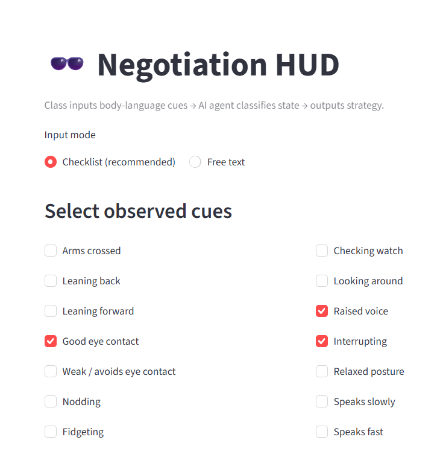
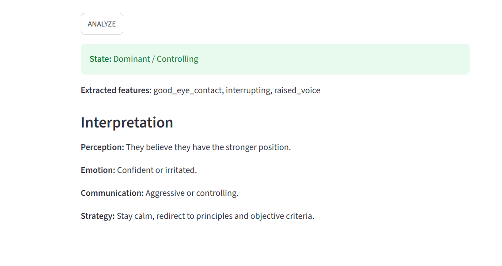

# 🕶️ Negotiation HUD

A decision-support tool that reads body-language cues and suggests a negotiation
strategy. Inspired by the idea that strategy should adapt *before* an offer is
made — a HUD (heads-up display) for reading the room.

Describe (or check off) what you observe in the other person's body language,
and the app classifies their likely emotional/behavioral state and returns a
plain-English read on their perception, emotion, communication style, and a
suggested counter-strategy.

## Screenshots

| Input | Output |
|---|---|
|  |  |

## How it works

This is a **rule-based classifier**, not a trained ML model — every decision
it makes is traceable back to an explicit rule, which makes it fully
explainable (you can always see *why* it flagged someone as "defensive").

```
Input (checklist or free text)
        │
        ▼
Feature extraction   →  normalizes raw cues into a fixed feature set
  (KEYWORD_MAP)          e.g. "folded arms" / "arms crossed" → crossed_arms
        │
        ▼
Rule-based scoring    →  each feature casts a vote toward one or more of
  (score_states)          6 behavioral states (Dominant, Impatient,
                           Defensive, Engaged, Nervous, Confident)
        │
        ▼
Prediction             →  picks the top-scoring state, computes a
  (predict_state)          confidence score, and flags a secondary state
                           if the top two are close (mixed signals)
        │
        ▼
Interpretation          →  maps the winning state to perception, emotion,
  (interpret_human_          communication style, and suggested strategy
   factors)
```

### Example

Input: *"He is leaning back with crossed arms and avoids eye contact."*

```
Extracted features: crossed_arms, leaning_back, weak_eye_contact
State: Defensive / Not convinced   (confidence: 1.0)

Perception:    They likely see your proposal as risky or unfair.
Emotion:       Anxious or resistant.
Communication: Closed posture and low information sharing.
Strategy:      Slow down, ask open questions, use objective criteria.
```

## Project structure

```
negotiation-hud/
├── app.py                 # Streamlit front-end (checklist + free-text modes)
├── negotiation_agent.py   # Feature extraction, rule-based classifier, agent wrapper
├── requirements.txt
├── LICENSE
└── README.md
```

## Getting started

```bash
# clone the repo
git clone https://github.com/<your-username>/negotiation-hud.git
cd negotiation-hud

# create and activate a virtual environment
python -m venv .venv
source .venv/bin/activate      # Windows: .venv\Scripts\Activate.ps1

# install dependencies
pip install -r requirements.txt

# run the app
streamlit run app.py
```

The app also has a small CLI demo you can run directly:

```bash
python negotiation_agent.py
```

## Design notes

- **`NegotiationAgent`** wraps the feature extractor behind a pluggable
  interface (`feature_extractor: Callable[[str], Set[str]]`). Today it's
  text-based keyword matching; the interface is deliberately built so a
  different extractor (e.g. a trained classifier, or a computer-vision
  pipeline reading real body language) could be swapped in without touching
  the scoring or interpretation logic.
- **Confidence + mixed-signal detection**: rather than a single hard label,
  `predict_state` returns a confidence score and, when the top two states are
  close, a secondary state — useful because real body language is often
  ambiguous.
- **Explainability first**: every prediction carries a `rationale` mapping
  each state to the exact features that voted for it, so the output is never
  a black box.

## Possible extensions

- Replace the hand-built `KEYWORD_MAP` + voting rules with a trained text
  classifier (e.g. TF-IDF + logistic regression) on a labeled dataset of
  descriptions → states, for comparison against the rule-based baseline.
- Swap in a computer-vision feature extractor for real-time cues.
- Add a confidence-weighted UI that visually highlights which specific cues
  drove the classification.

## License

MIT — see [LICENSE](LICENSE).
